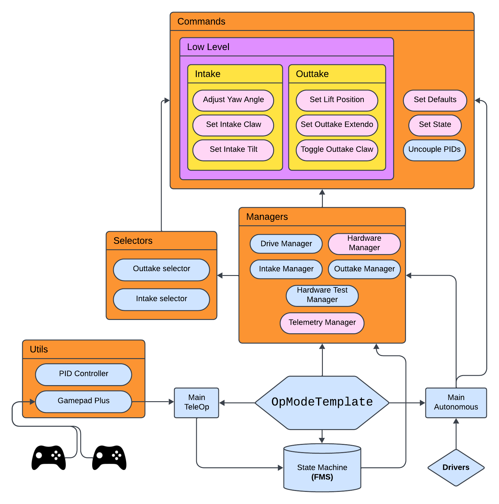

# MAGIS FTC Team Repository

This repository is a **FORK** of the public **FTC SDK** for the **INTO THE DEEP** (2024-2025) competition season written by [Rokas Kirdulis](https://github.com/Tarkkett).

## Overview

- The `teamcode` folder contains the main command-based control system for the robot.
- This folder includes custom classes and methods designed specifically to support autonomous and teleoperated (teleop) modes for our team's robot.
- Code is structured to enhance modularity, making it easy to test individual components and integrate new features throughout the season.

## Key Components

### Subsystems
The `teamcode` directory is organized around the **command-based model**, with specific **subsystems**( or `managers` as I call them) for each part of the robot:
- **Drive** - Manages all movement algorithms, including heading autocorrection.
- **Hardware** - Defines every motor, servo, hub, other device/sensor as an object - ready to be used by all other subsystems.
- **Intake** - Controls the robot's intake system, with positional controls for `TiltServo`, `PitchServo`, `ClawServo` and `YawServo`. Used for picking up game elements.
- **Outtake** - Manages the opening and closing of the `ClawServo`, as well as positional controls for the `PitchServo`, `YawServo` and `TiltServo`.
  
### Autonomous and Teleop Modes
- **Autonomous**: Pre-defined routines to perform tasks at the start of the game utilizing motion planning. Our robot is able to consistently achieve a 5 specimen autonomous. Sadly, we did not develop a sample autonomous :(
- **Teleop**: Driver-controlled routines that provide manual and assisted control over the robot. Robot operates on a fixed two-driver setup.

### State Machine

Our robot uses a **State Machine** design pattern to organize and manage various states and transitions that occur during the competition. The state machine makes it easy to control and update the robot’s behavior in both **autonomous** and **teleoperated** modes, ensuring smooth transitions between tasks. See the `StateMachine` class.

#### Key Concepts
- **States**: Each state represents a distinct behavior or action that the robot performs (e.g., driving, lifting the arm, grabbing objects). Every system in our robot has it's own list of possible states and operates that way.
- **Transitions**: The state machine combined with commands from subsystems allows for the robot to transition from one state to another based on specific conditions, such as sensor/gamepad inputs or time.
- **State Management**: The state machine runs continuously, checking conditions to decide when to enter, execute, or exit states.
  
### Additional Resources
- Our robot uses GoBilda’s Pinpoint Computer along with two Four-Bar Odometry pods for localization and trajectory following. It runs on Pedro Pathing algorithms, which you can learn more about here: https://pedropathing.com/.
- Code comments throughout to assist with debugging, testing, and modifications by new team members or collaborators.

---

---
Our team wishes You happy coding and best of luck for the current **First Tech Challenge** season!
